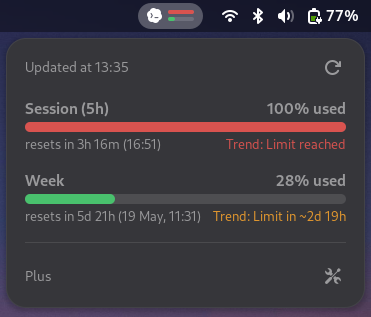

<div align="center">
  <h1>Codex Meter</h1>
  <p><strong>Monitor your Codex usage from the GNOME top panel.</strong></p>
  <p>
    <a href="https://github.com/slobbe/codex-meter/releases/latest">
      
    </a>
    <a href="LICENSE">
      
    </a>
  </p>
  <p>
    
  </p>
</div>

> Inspired by [CodexBar](https://github.com/steipete/CodexBar) by [Peter Steinberger](https://github.com/steipete), adapted for GNOME.

## Features

- Displays current 5-hour session and weekly Codex usage.
- Predicts whether current usage trends will hit the session or weekly limit before reset.
- Choose between raw percentages, progress bars, or unified _combined-pressure_ bar in the panel indicator.
- Show percentages as usage consumed or capacity left.
- Supports manual refresh and configurable background refresh intervals.

## Install

> [!NOTE]
> Requires the Codex CLI and an active login on the same machine.
> The extension reads your local local auth credentials from `~/.codex/auth.json` to fetch usage data from `https://chatgpt.com/backend-api/wham/usage`.

1. Download the [latest release](https://github.com/slobbe/codex-meter/releases/latest) zip.
2. Install and enable the extension with:

```sh
gnome-extensions install --force codex-meter@slobbe.github.io-<version>.zip
gnome-extensions enable codex-meter@slobbe.github.io
```

If GNOME does not pick it up immediately, log out and back in.

## Development / Build

For local development, run the following commands:

```sh
make install
gnome-extensions disable codex-meter@slobbe.github.io
gnome-extensions enable codex-meter@slobbe.github.io
```

You may need to log out and back in to see the changes.

To build a release bundle locally:

```sh
make clean pack
```

## License

[GPL-3.0-or-later](/LICENSE)
