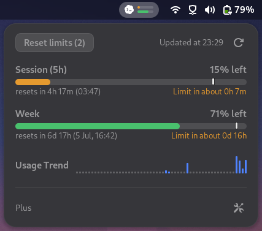

<p align="center">
  <picture><source media="(prefers-color-scheme: dark)" srcset="https://shieldcn.dev/header/surface.svg?title=Codex+Meter&amp;subtitle=Monitor+your+Codex+usage+from+the+GNOME+top+panel&amp;logo=https%3A%2F%2Fraw.githubusercontent.com%2Fslobbe%2Fcodex-meter%2Frefs%2Fheads%2Fmain%2Fdocs%2Fassets%2Flogo%2Flogo.svg&amp;mode=dark&amp;border=false" /></picture>
</p>

<p align="center">
  <picture><source media="(prefers-color-scheme: dark)" srcset="https://shieldcn.dev/badge/-45%2B.svg?variant=branded&amp;logo=gnome&amp;label=GNOME&amp;color=3b82f6" /></picture>
</p>

<p align="center">
  <picture><source media="(prefers-color-scheme: dark)" srcset="https://shieldcn.dev/group/github/slobbe/codex-meter/release+github/slobbe/codex-meter/license.svg?variant=secondary" /></picture>
</p>

<p align="center">
  
</p>

## Features

- Displays current 5-hour session and weekly Codex usage.
- Shows a weekly usage trend and predicts whether limits will be hit before reset.
- Shows and redeems available banked resets.
- Show percentages as usage consumed or capacity left.
- Choose between raw percentages or progress bars in the panel indicator.

## Install

> [!NOTE]
> Requires the Codex CLI and an active login on the same machine.
> The extension reads your local local auth credentials from `~/.codex/auth.json` to fetch usage data from `https://chatgpt.com/backend-api/wham/usage`.

1. Download the [latest release](https://github.com/slobbe/codex-meter/releases/latest) zip.
2. Install and enable the extension with:

```sh
gnome-extensions install --force codex-meter@slobbe.github.io-<version>.zip
gnome-extensions enable codex-meter@slobbe.github.io
```

If GNOME does not pick it up immediately, log out and back in.

## Development / Build

For local development, run the following commands:

```sh
make install
gnome-extensions disable codex-meter@slobbe.github.io
gnome-extensions enable codex-meter@slobbe.github.io
```

You may need to log out and back in to see the changes.

To build a release bundle locally:

```sh
make clean pack
```
