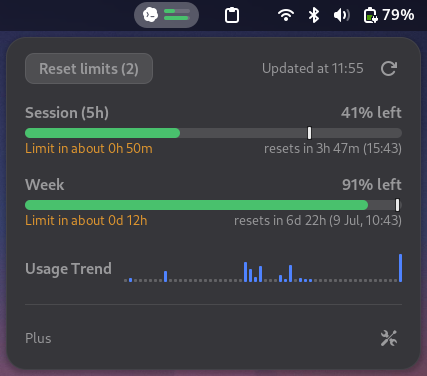

# Codex Meter

Monitor and manage Codex usage limits.

<p align="center">
  
</p>

## Features

- Displays current 5-hour session and weekly Codex usage.
- Shows a weekly usage trend and predicts whether limits will be hit before reset.
- Shows and redeems available banked resets.

## Requirements

- [Codex CLI](https://developers.openai.com/codex/cli) logged in on the same machine
- GNOME Shell 45+

## Install

1. Download the [latest release](https://github.com/slobbe/codex-meter/releases/latest) zip.
2. Install and enable the extension with:

```sh
gnome-extensions install --force codex-meter@slobbe.github.io-<version>.zip
gnome-extensions enable codex-meter@slobbe.github.io
```

If GNOME does not pick it up immediately, log out and back in.

## Privacy

Codex Meter reads your local Codex auth credentials from `~/.codex/auth.json` and uses them to fetch usage and banked reset data from ChatGPT. It does not store those credentials or transmit them anywhere else.

The extension stores non-credential usage data locally so the panel can show cached state, trends, and banked reset information while refreshing. It writes the latest usage and banked-reset snapshots in the user cache directory, typically `~/.cache/codex-meter`, and usage history in the user state directory, typically `~/.local/state/codex-meter`. Usage history is pruned to roughly the last 21 days and at most 25,000 entries. These files are written with private file permissions where supported by the platform.

## License

[GPL-3.0-or-later](LICENSE)
