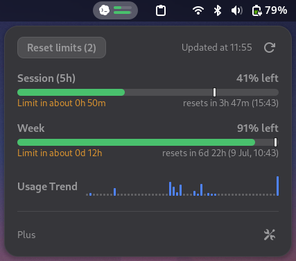

<div align="center">
  <h1>Codex Meter</h1>
  <p>A GNOME Shell extension to monitor and manage Codex usage limits from your top bar.</p>
  <p>
    <a href="https://github.com/slobbe/codex-meter/releases/latest"></a>
    <a href="https://github.com/slobbe/codex-meter/actions/workflows/ci.yml"></a>
    <a href="#requirements"></a>
  </p>
</div>
<p align="center">
  
</p>

## Features

- Displays current 5-hour session and weekly Codex usage.
- Shows a weekly usage trend and predicts whether limits will be hit before reset.
- Shows and redeems available banked resets.
- Can automatically apply a banked reset within one hour of expiry.

## Requirements

- [ChatGPT desktop app](https://chatgpt.com/download/) or [Codex CLI](https://developers.openai.com/codex/cli), signed in with your ChatGPT account on the same machine
- GNOME Shell 45+

## Install

1. Download the [latest release](https://github.com/slobbe/codex-meter/releases/latest) zip.
2. Install and enable the extension with:

```sh
gnome-extensions install --force codex-meter@slobbe.github.io-<version>.zip
gnome-extensions enable codex-meter@slobbe.github.io
```

If GNOME does not pick it up immediately, log out and back in.

## Update and uninstall

To update, download the latest release and repeat the install steps, then log out and back in.

To uninstall:

```sh
gnome-extensions uninstall codex-meter@slobbe.github.io
```

## Troubleshooting

- **Extension not showing:** check that it is enabled in the Extensions app, then log out and back in.
- **Usage not loading or authentication expired:** sign back in through the ChatGPT desktop app or Codex CLI, and check your internet connection.
- **Still stuck:** [open an issue](https://github.com/slobbe/codex-meter/issues) with your GNOME Shell version and the error message. Never share your auth file or tokens.

## Limitations

Codex Meter relies on ChatGPT backend endpoints, so upstream changes may temporarily affect functionality.

## Privacy

Codex Meter reads credentials from `~/.codex/auth.json` to request usage and banked reset data from ChatGPT. It does not store credentials or send them anywhere else.

Usage data is cached locally in `~/.cache/codex-meter` and `~/.local/state/codex-meter`, with history kept for roughly 21 days (up to 25,000 entries).

## License

[GPL-3.0-or-later](LICENSE)

---

_Not affiliated with or endorsed by OpenAI._
